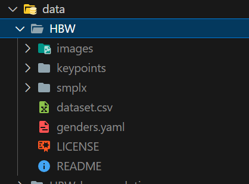
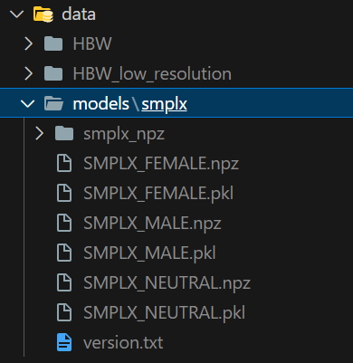
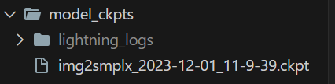

# Human Body Shape Estimation
Estimating Body Shape using 2D images. In our first iteration, we are building on the work of Choutas et al., using their SHAPY model to predict Anthropometric measurements of fashion models from images. 

You can clone the code from the [github](https://github.com/nikhil-chigali/Human_Body_Shape_Estimation.git) repo
## Dataset
The dataset of choice is [Human Bodies in the wild](https://shapy.is.tue.mpg.de/datasets.html). This is a dataset collected by Choutas et al., for their paper - '[Accurate 3D Body Shape Regression using Metric and Semantic Attributes](https://shapy.is.tue.mpg.de/index.html)' 

You will need to sign up on their website and download the HBW dataset. Unzip the contents to the data/ folder in the root directory with the following format:

> Note : Make sure the dataset has the `genders.yaml` file in it. If not found, try downloading `HBW_low_resolution` dataset from the same site. It should have the `genders.yaml` file.

## SMPLx model
The project uses SMPLx body models to predict 3D mesh vertices from predited $\beta$ values. Download the SMPLx model weights from [here](https://smpl-x.is.tue.mpg.de/) and place it in the datafolder as shown below:

## Before getting started
Goto `src > utils > configs.py` and verify the file and directory paths. You can also adjust your training hyperparameters in this file.

If you are looking to train the model, you will also need to sign-up on [Weights and Biases](wandb.ai) to log your training metrics and visualize progress.

You can install the dependencies necessary to run the project by running the command:
> `pip install -r requirements.txt`

## Training
Modify the paths for the model checkpoints, gender.yaml file, smplx model weights, 3D mesh labels, etc., before you get started with the training.
Set the epochs, learning rate, learning rate step milestones, and other hyperparameters.

Run the file `main.py` to start training. Visualize the training progress on your WeightsAndBiases dashboard. The best model will be saved under the folder `model_ckpts` with the timestamp.

## Inference
To test your model, open the notebook `demo.ipynb` and run each code cell after adjusting the path variables as required.
You can download the pretrained model weights from this drive [link](https://drive.google.com/drive/folders/1PY4c24yjwYoDDNgylOQvD263vpRU9x8I?usp=sharing) to the model_ckpts folder as shown below:

## References
* Choutas, V., Muller, L., Huang, C.H., Tang, S., Tzionas, D., & Black, M. (2022). Accurate 3D Body Shape Regression using Metric and Semantic Attributes. In Proceedings IEEE Conf. on Computer Vision and Pattern Recognition (CVPR).
* Vision Transformers blog: https://uvadlc-notebooks.readthedocs.io/en/latest/tutorial_notebooks/tutorial15/Vision_Transformer.html

